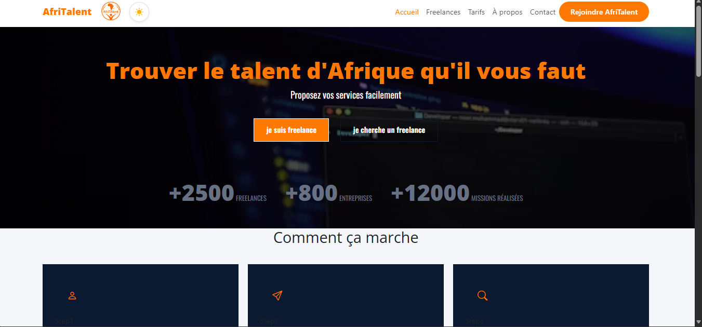
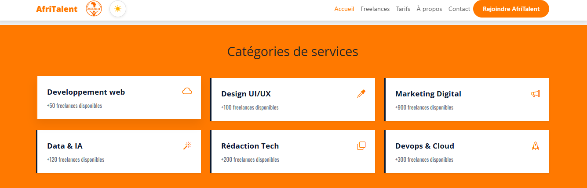
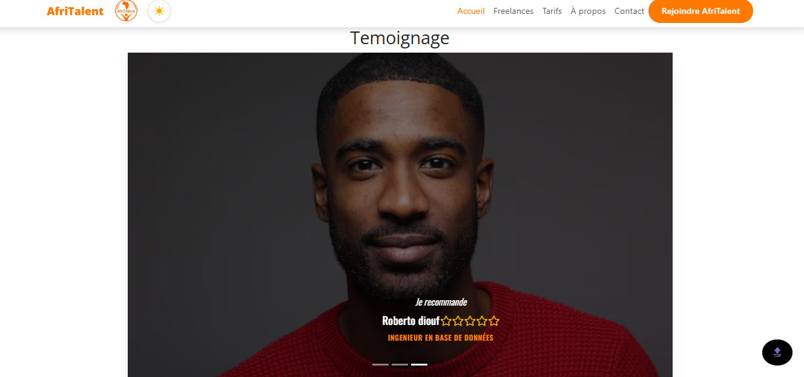
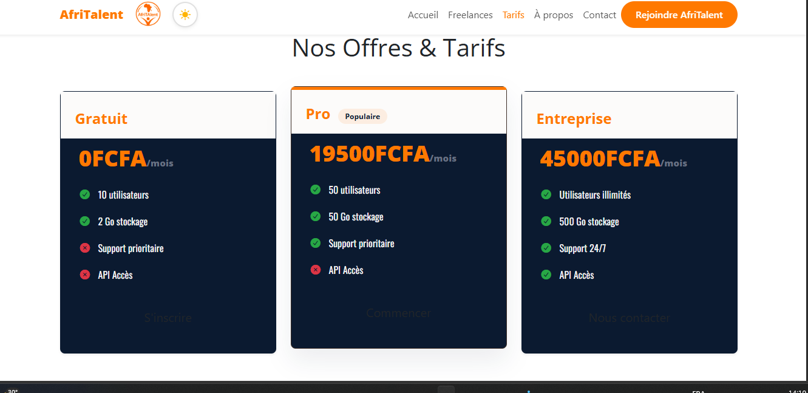
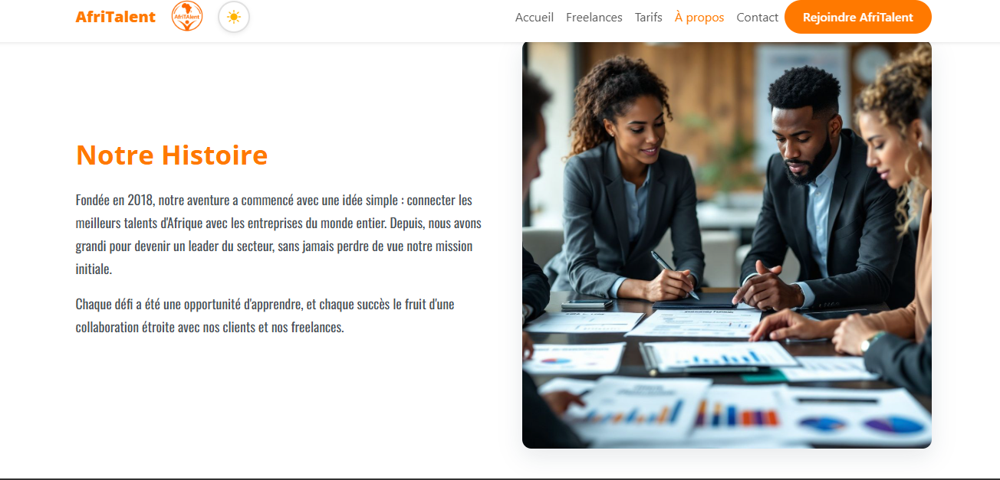

# AfriTalent
Projet fil rouge — Plateforme de mise en relation entre freelances africains et
clients.
Auteur : Ndéye Déguéne Wade
Promotion : L1 IAGE Web — ISI

AfriTalent est une plateforme dédiée à la valorisation des talents africains. Elle permet aux professionnels, créateurs, entrepreneurs et jeunes talents de présenter leurs compétences, développer leur visibilité et accéder à de nouvelles opportunités.

## Objectifs

- Mettre en lumière les talents africains.
- Faciliter la mise en relation entre talents et recruteurs.
- Offrir une plateforme de visibilité aux créateurs et professionnels.
- Encourager l'innovation et l'entrepreneuriat en Afrique.

 ## Fonctionnalités principales

- Navigation responsive
- Recherche et filtrage de freelances
- Présentation des offres tarifaires
- Formulaire de contact avec validation
- Mode sombre (Dark Mode)
- Animations et compteurs dynamiques
- Design responsive pour mobile et tablette

## Technologies Utilisées

- HTML5
- CSS3
- JavaScript
- Bootstrap 5

## Structure du Projet
NOM-Prenom-AfriTalent/
├── index.html
├── freelances.html
├── tarifs.html
├── about.html
├── contact.html
├── css/
│ └── style.css
├── js/
│ └── main.js
├── images/
│ └── (vos images, logos, avatars)
├── docs/
│ └── NOM_Prenom_Presentation.pptx
├── README.md
└── .gitignore

 ### lien de la page github : https://ndeyedeguenewade6-creator.github.io/WADE_NdeyeDegu-ne_AfriTalent/

 ## Installation

1. Télécharger ou cloner le projet.
2. Ouvrir le dossier du projet.
3. Lancer le fichier `index.html` dans un navigateur web.

Aucune installation supplémentaire n'est nécessaire.
   
### Configuration globale du style

Cette section importe les polices Google Fonts utilisées dans le projet (**Open Sans** pour les titres et **Oswald** pour le contenu). Elle définit également les variables CSS principales (couleurs, polices, espacements et bordures) afin d'assurer une cohérence visuelle sur l'ensemble de l'application.

Un reset CSS est appliqué pour supprimer les styles par défaut des navigateurs et garantir un affichage uniforme. Enfin, les styles de base du site sont configurés, notamment la police principale, les couleurs du texte, l'arrière-plan et l'apparence des titres.

### Page d’accueil (Index)

La page d’accueil est le point d’entrée d’AfriTalent. Elle comprend une barre de navigation responsive, une section Hero avec un titre, une description, des boutons d’action et des statistiques. Une Bento Grid présente les principales fonctionnalités de la plateforme, suivie d’une section Services, d’un carrousel de témoignages, d’un appel à l’action (CTA) et d’un footer contenant les liens et informations essentielles.

### Page Freelances

Cette page permet de rechercher des freelances grâce à des filtres interactifs par catégorie ou compétence. Les profils sont affichés sous forme de cartes présentant les informations essentielles (photo, spécialité, description, note et tarif) avec des effets de survol pour améliorer l’expérience utilisateur.

### Page Tarifs et FAQ

La page Tarifs présente les différentes offres d’abonnement à l’aide de cartes interactives, dont une offre recommandée mise en avant. Une section FAQ, réalisée avec un accordéon Bootstrap, répond aux principales questions des utilisateurs.

### Page À propos

La page À propos présente l’histoire, les valeurs et l’équipe d’AfriTalent. Elle comprend également une section de chiffres clés affichés dans une grille Bento responsive avec des animations pour mettre en valeur les statistiques de la plateforme.

### Page Contact

La page Contact propose un formulaire avec validation des champs ainsi que les coordonnées de l’équipe. Une carte Google Maps responsive permet de localiser facilement l’entreprise.

### Responsive Design

Le site utilise des Media Queries afin d’assurer une adaptation optimale sur tous les appareils. Les grilles et les sections sont réorganisées sur mobile pour garantir une navigation fluide et une bonne lisibilité.

### Fonctionnalités Interactives

AfriTalent intègre un mode sombre avec sauvegarde des préférences, une barre de navigation qui s’adapte au défilement de la page ainsi qu’un bouton de retour en haut avec un défilement fluide.

### Animations et Dynamisme

Des animations Fade-In sont utilisées pour faire apparaître progressivement les sections lors du défilement. Des compteurs animés mettent également en valeur les principales statistiques de la plateforme.

### Fonctionnalités JavaScript

Le projet intègre un système de filtrage dynamique des freelances ainsi qu’un formulaire de contact avec validation des champs, messages d’erreur et confirmation d’envoi.

### Conclusion

AfriTalent est une plateforme web moderne destinée à valoriser les talents africains et à faciliter leur mise en relation avec des clients. Ce projet a permis de mettre en pratique les compétences acquises en HTML, CSS, JavaScript et Bootstrap dans le cadre du projet fil rouge de la formation L1 IAGE Web.

## captures d'ecran

## section Hero

## freelances

## Tarifs

## about 

.png)

## Contact
